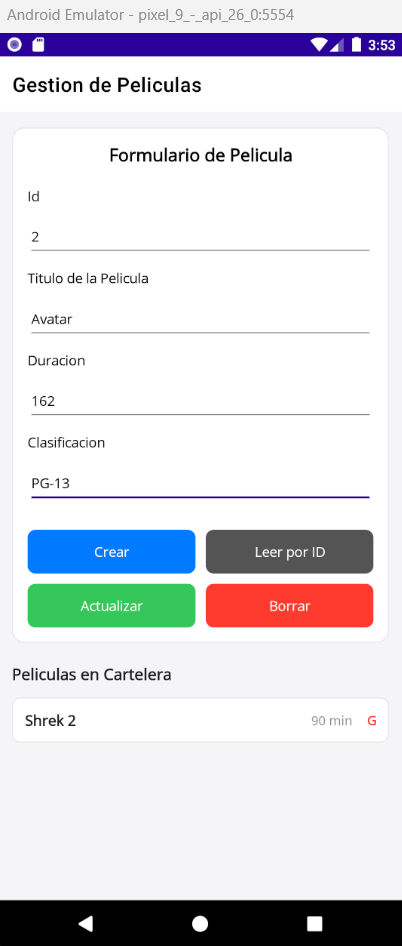
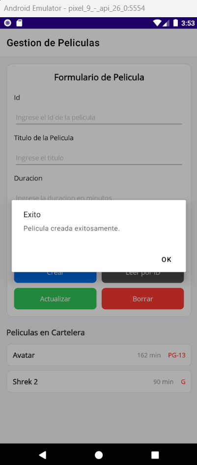
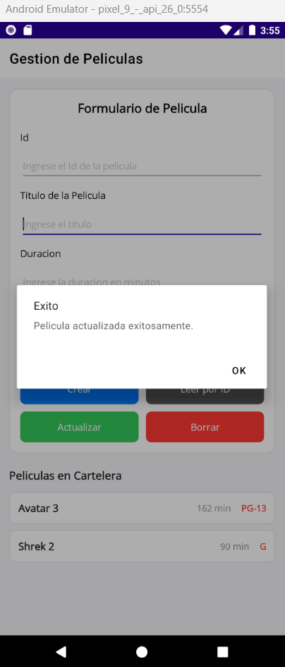
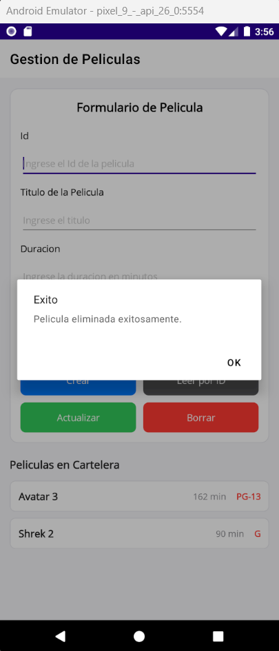
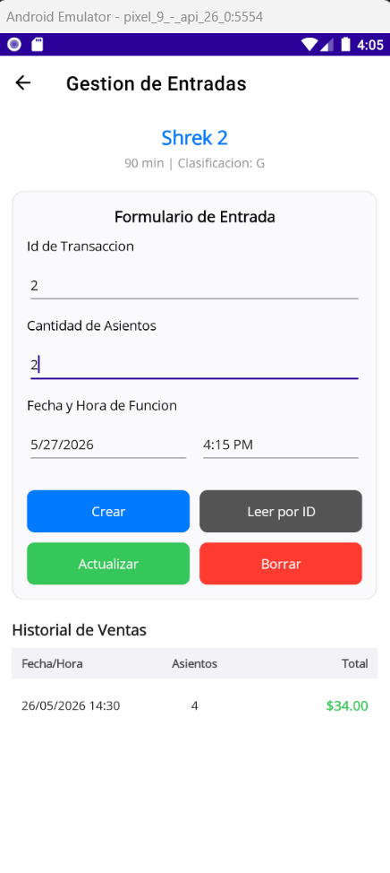
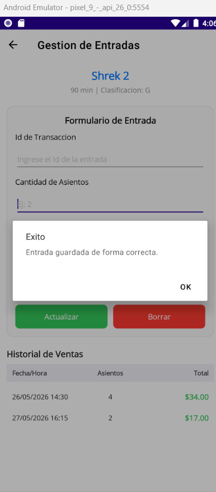
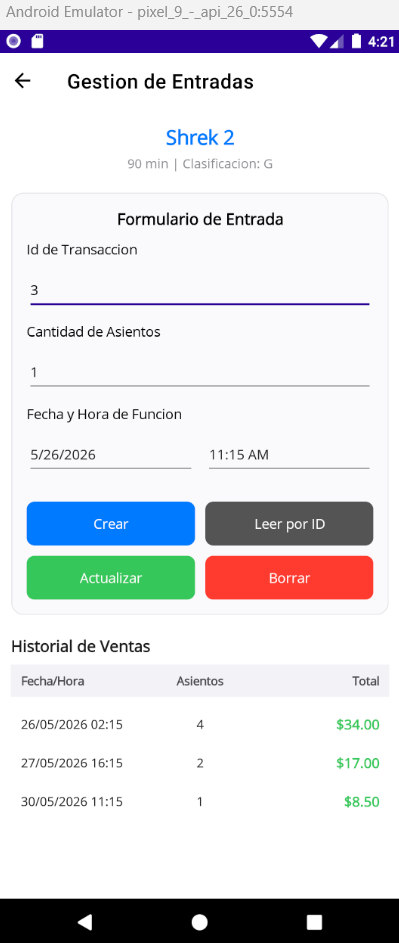
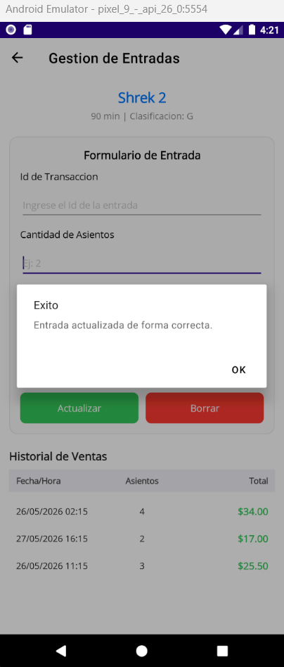
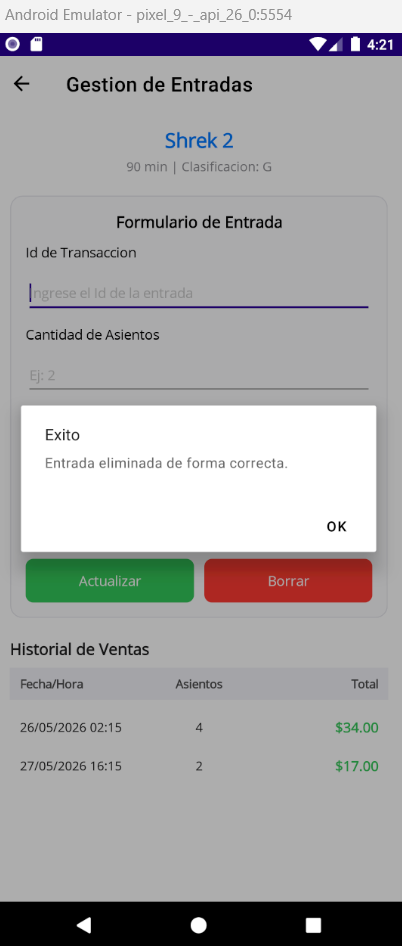

# App de Gestión de Cine (.NET MAUI)

Este repositorio contiene una aplicación móvil nativa desarrollada con **.NET MAUI**. El objetivo de este proyecto fue construir un sistema práctico y rápido para administrar una cartelera de cine y sus ventas, guardando todo de forma local usando **SQLite** y **Dapper**.

## ¿Qué se logró en este proyecto?

Se implementó una estructura de **Maestro-Detalle** que cuenta con todas las operaciones CRUD (Crear, Leer, Actualizar y Borrar) funcionando al 100%. El sistema se divide en dos partes principales:

1. **Películas (Maestro):** Un panel para agregar y editar las películas que están en cartelera.
2. **Entradas (Detalle):** Al seleccionar una película, podemos registrar la venta de boletos, calculando el total y guardando la fecha y hora exacta de la función.

A continuación, un pequeño recorrido visual por la aplicación:

---

### 1. Panel de Películas
Administración general de la cartelera. Permite registrar la información básica, consultar mediante un ID único, modificar errores o retirar cintas.

**Crear Registro:**

**Consultar por ID:**

**Actualizar Información:**

**Eliminar Registro:**

---

### 2. Venta de Entradas
Sección dedicada a las transacciones. Registra cuántos asientos se compran para una película en específico y mantiene un historial limpio.

**Registrar Nueva Compra:**

**Revisar Boleto por ID:**

**Modificar Transacción:**

**Borrar/Cancelar Venta:**

